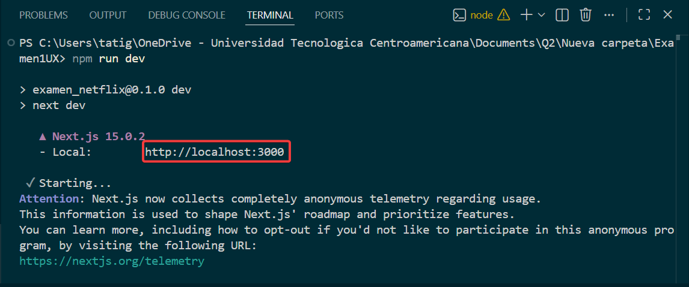

# Netflix Main Page

Este proyecto es una réplica del frontend de la página principal de Netflix, desarrollada como parte de la clase de **Experiencia de Usuario**. El objetivo principal es aplicar conceptos de diseño responsivo, interactividad y componentes dinámicos.

## 🎥 Vista Previa


## ✨ Características Principales
* **Diseño Fiel y Responsivo:** Implementación de fuentes y estilos similares a la plataforma original utilizando `useMediaQuery` y `useTheme` para adaptabilidad.
* **Secciones Dinámicas:** Organización de contenido en categorías como "Continuar Viendo" y "Mi lista".
* **Efecto Hover Interactivo:** Al pasar el cursor sobre una Card, se valida el estado para mostrar un adelanto en video en lugar de una imagen estática.
* **Carrusel Automático:** Sistema de navegación por filas que divide las cartas en grupos para una visualización fluida.
* **Navegación Eficiente:** Implementación de una AppBar funcional y un Footer detallado.

## 🛠️ Tecnologías Utilizadas
* **Framework:** Next.js 15.0.2.
* **Librerías de UI:** React 18, Material UI (@mui/material), Emotion (styled).

## 🚀 Instalación y Ejecución
Seguí estos pasos para clonar y correr el proyecto en tu máquina local:

### 1. Clonar el proyecto:
```bash
git clone https://github.com/andreaortez/Examen1UX.git
```
### 2. Instalar dependencias:
Entrá a la carpeta del proyecto y ejecutá:
```bash
npm install
```
En caso de errores de compilación, podés intentar forzar la versión de React con:
```bash
npm install react@^18.0.0 react-dom@^18.0.0
npm install @mui/material @emotion/react @emotion/styled
npm install react-material-ui-carousel --save
```
### 3. Iniciar el servidor de desarrollo:
```bash
npm run dev
```
### 4. Ver el resultado
Una vez que el servidor esté listo, hacé clic en el link generado, y podrás ver la página. Usualmente es `http://localhost:3000`.



---

## 👥 Colaboradores

<table border="0">
  <tr>
    <td align="center">
      <a href="https://github.com/andreaortez">
        <br />
        <b>Andrea J. Ortez</b>
      </a>
    </td>
    <td align="center">
      <a href="https://github.com/Tatiana-Garcia">
        <br />
        <b>Tatiana Z. Garcia</b>
      </a>
    </td>
  </tr>
</table>


